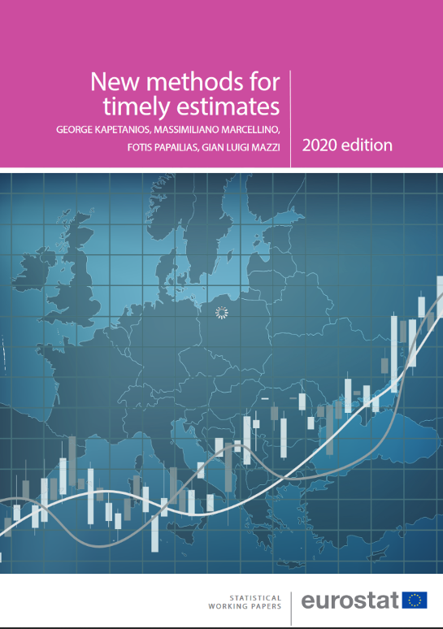

panelvar
=========

Experimental tools on pVAR models for timely estimates.
---

The material provided herein will enable you to reproduce the experiments presented in _Eurostat_ statistical working paper on [**New methods for timely estimates**](https://ec.europa.eu/eurostat/web/products-statistical-working-papers/-/KS-TC-20-005) (_cite this source code or the reference's doi: [10.2785/600130](http://dx.doi.org/10.2785/600130)_). Further details are also available in the other associated working papers (see Kapetanios _et al._'s publications [below](#References)).

**Description**

The source code is provided *as is* in the [**_model/_**](model) folder so as to explore out-of-sample forecasting performance of mixed-frequency panel vector autoregression (pVAR) models for four key macroeconomic variables, with the goal of providing evidence on the usefulness and reliability of these models for use by official statistical agencies. 

Data from four European economies, as used in the paper, are made available under the [**_data/input_**](data) folder. Output data will be stored into an **data/output/ folder that needs to be created beforehand**.  

Additionally, the source code in [**_tables/_**](tables) enable to reproduce some figures of the working paper that are stored in the [**_data/tables_**](tables) folder

**Usage**

To run the experiments, you will need to prior install the following package dependencies: [`forecast`](https://cran.r-project.org/web/packages/forecast/index.html), [`imputeTS`](https://cran.r-project.org/web/packages/imputeTS/index.html), [`panelvar`](https://cran.r-project.org/web/packages/panelvar/panelvar.pdf), [`lubridate`](https://cran.r-project.org/web/packages/lubridate/index.html), [`vars`](https://cran.r-project.org/web/packages/vars/index.html), [`moments`](https://cran.r-project.org/web/packages/moments/index.html) and [`zoo`](https://cran.r-project.org/web/packages/zoo/index.html).

Once the packages installed, you can run the `bash` scripts in the [**_bin/_**](bin) folder.

**About**

<table align="center">
    <tr>     <td  rowspan="4" align="center" width="140px"> <a href="https://ec.europa.eu/eurostat/documents/3888793/10879237/KS-TC-20-005-EN-N.pdf"></img></a></td>
<td align="left"><i>authors</i></td> <td align="left"> <a href="mailto:fotis.papailias@quantf.com">Papailias F.</a>, 
	<a href="mailto:kapetaniosgeorge@gmail.com">Kapetanios G.</a>, <a href="mailto:massimiliano.marcellino@unibocconi.it">Marcellino M.</a>, 
	and <a href="mailto:glmazzi@pt.lu">Mazzi G.L.</a></td> </tr> 
    <tr> <td align="left"><i>version</i></td> <td align="left">1.0</td> </tr> 
    <tr> <td align="left"><i>status</i></td> <td align="left">2020 &ndash; <b>closed</b></td> </tr> 
    <tr> <td align="left"><i>license</i></td> <td align="left"><a href="https://joinup.ec.europa.eu/sites/default/files/eupl1.1.-licence-en_0.pdfEUPL">EUPL</a> <i>(cite the source code or the reference above!)</i></td> </tr> 
</table>

**References** 

* Kapetanios G., Marcellino M., Papailias F. and Mazzi G.L. (2020): [**New methods for timely estimates**](https://ec.europa.eu/eurostat/web/products-statistical-working-papers/-/KS-TC-20-005), _Eurostat_ Statistical Working Paper KS-TC-20-005-EN, doi: [10.2785/600130](http://dx.doi.org/10.2785/600130).

* Mazzi G.L. and Mitchell J. (2020): [**New methods for timely estimates: nowcasting euro area GDP growth using quantile regression**](https://ec.europa.eu/eurostat/documents/3888793/10879121/KS-TC-20-004-EN-N.pdf/9916fb06-56e5-bf81-56c7-8b7c8d1f7c2e), _Eurostat_ Statistical Working Paper S-TC-20-004-EN, doi: [10.2785/26603](http://dx.doi.org/10.2785/26603).

* Sigmund M. and Ferstl R. (2019): **Panel Vector Autoregression in R with the package Panelvar**, _Quarterly Review of Economics and Finance_, doi: [10.2139/ssrn.2896087](http://dx.doi.org/10.2139/ssrn.2896087).

* Mazzi G.L. and Ladiray D., eds. (2017): 
*[**Handbook on Rapid Estimates**](http://ec.europa.eu/eurostat/documents/3859598/8555708/KS-GQ-17-008-EN-N.pdf), 
_Publications Office of the European Union_, doi:[10.2785/4887400](http://dx.doi.org/10.2785/4887400).

* Dees S. and Gunter J. (2014): [**Analysing and forecasting price dynamics across Euro area countries and sectors - A panel var approach**](https://www.ecb.europa.eu/pub/pdf/scpwps/ecbwp1724.pdf), _European Central Bank_ Working Paper QB-AR-14-098-EN, no. 1724.

* Croissant Y. and Millo G. (2008): [**Panel data econometrics in R: The plm package**](https://www.jstatsoft.org/v27/i02/paper), _Journal of Statistical Software_, 27(2):1-43, doi: [10.18637/jss.v027.i02](http://dx.doi.org/10.18637/jss.v027.i02).
